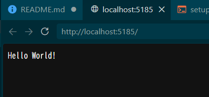

# wsl_dotnet_study1

## 概要

* WSL を使って .NET 10 の開発環境を構築する

## 詳細

### 目次
* 環境構築
* 起動
* 削除
* コンソールアプリ
* ASP.NET Core

### 環境構築
```
$n="AlmaLinux-10-Dotnet10"; wsl --install AlmaLinux-10 --name $n --no-launch; wsl -u root -d $n -- ./setup.sh; wsl -t $n
```

### 起動
```
wsl -d AlmaLinux-10-Dotnet10
```

### 削除
```
wsl --unregister AlmaLinux-10-Dotnet10
```

### コンソールアプリ
```
cd ~
mkdir ConsoleApp1
cd ./ConsoleApp1 
dotnet new console
dotnet run
```

結果
```
$ dotnet run
Hello, World!
```

### ASP.NET Core
```
cd ~
mkdir ./AspDotnetCore1
cd ./AspDotnetCore1
dotnet new web
dotnet run
```

```
$ dotnet run
Using launch settings from /home/dev/AspDotnetCore1/Properties/launchSettings.json...
Building...
info: Microsoft.Hosting.Lifetime[14]
      Now listening on: http://localhost:5185
info: Microsoft.Hosting.Lifetime[0]
      Application started. Press Ctrl+C to shut down.
info: Microsoft.Hosting.Lifetime[0]
      Hosting environment: Development
info: Microsoft.Hosting.Lifetime[0]
      Content root path: /home/dev/AspDotnetCore1
```

